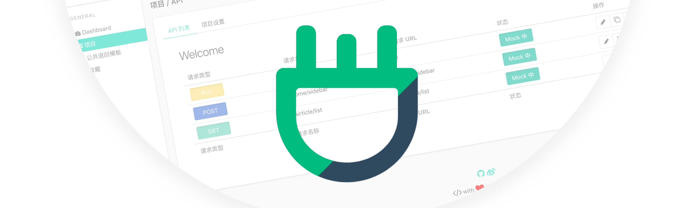
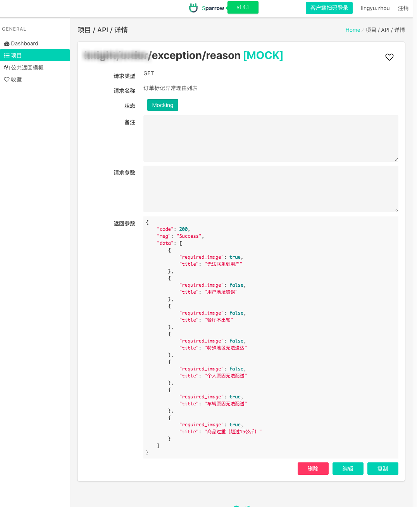
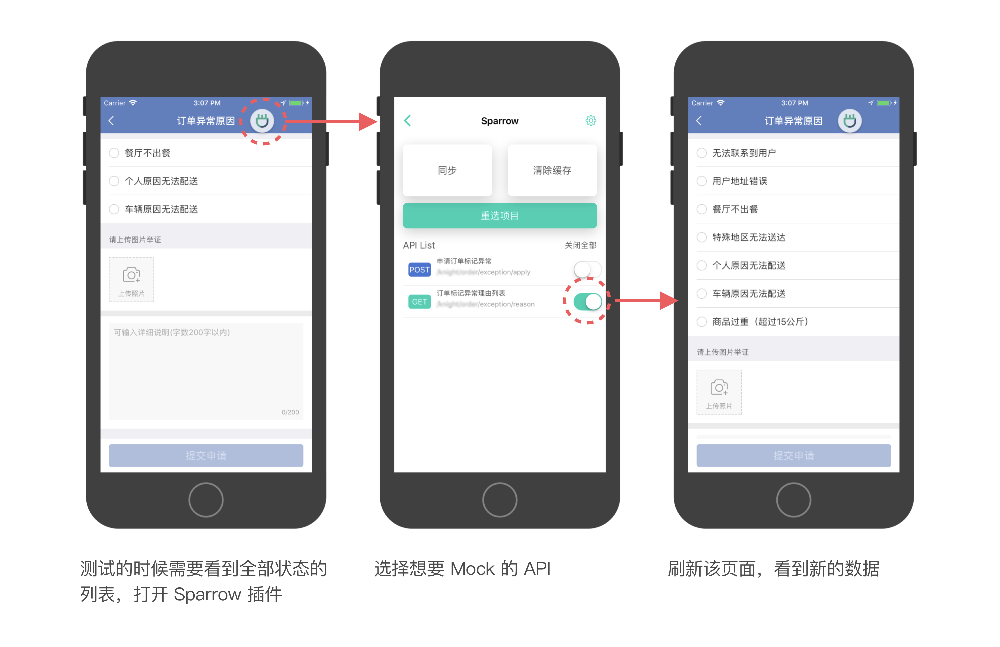

# Sparrow



## 功能简介

Sparrow 是为解决**移动端开发**的痛点而开发的 Mock 系统，Sever 配合移动端 SDK，实现无耦合、无代码修改的 Mock 功能，极大程度的提升 Mock 的体验感、开发效率、测试效率。

关于移动端 SDK，请访问 Sparrow SDK（[SparrowSDK-iOS](https://github.com/eleme/SparrowSDK-iOS)、[Sparrow-Android]( https://github.com/eleme/SparrowSDK-Android))。

### 示例

设置一个 Mock API，用于骑手 App『订单申请报备异常原因列表』：





如上图所示，Sparrow 可以实现不修改网络请求的代码，获取数据，并保留整个网络请求的过程，不需要手机设置代理。

## 服务器部署

### 基础环境

1. Python3 
2. pip3

### install

```shell
git clone git@git.elenet.me:LPD-iOS/Sparrow.git
cd Sparrow
pip install -r requirements.txt
python3 manage.py makemigrations
python3 manage.py migrate
python3 manage.py runserver 0.0.0.0:80
```

### 自定义前端

**如果需要自行修改前端内容，还需要以下环境：**

1. npm 基本环境
2. vue 环境


```shell
npm run build
```

> 具体还请参考 [Vue 的官方文档](https://cn.vuejs.org/index.html)


### 数据库配置

默认配置：

1. USER: test
2. PASSWORD: 123abc
3. HOST: 127.0.0.1
4. PORT: 3306

也可以在以下位置自行修改：

Sparrow -> settings.py ->

### 创建 Admin 超级管理员

```
python3 manage.py createsuperuser
```

示例过程

```
python3 manage.py createsuperuser
Username (leave blank to use 'zhoulingyu'): lingyu.zhou
Email address: lingyu.zhou@ele.me
Password: ***
Password (again): ***
Superuser created successfully.
```

### 后台登录地址

完整域名/admin

可以通过登录 admin 修改个人信息


